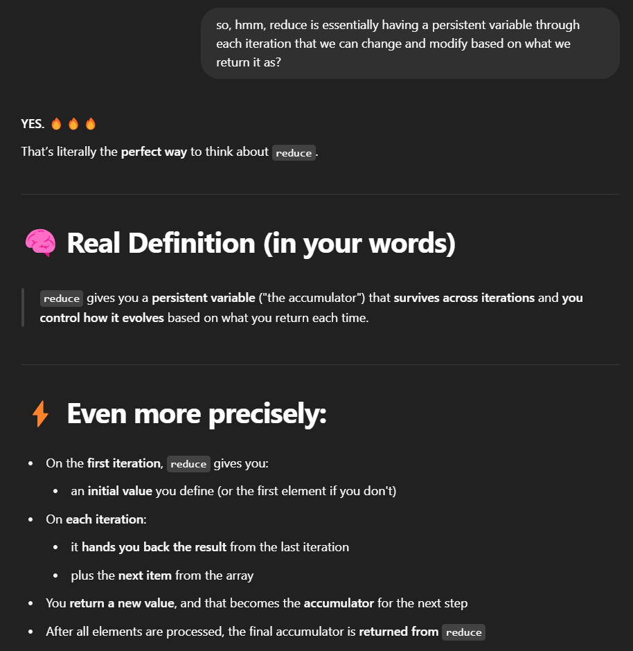
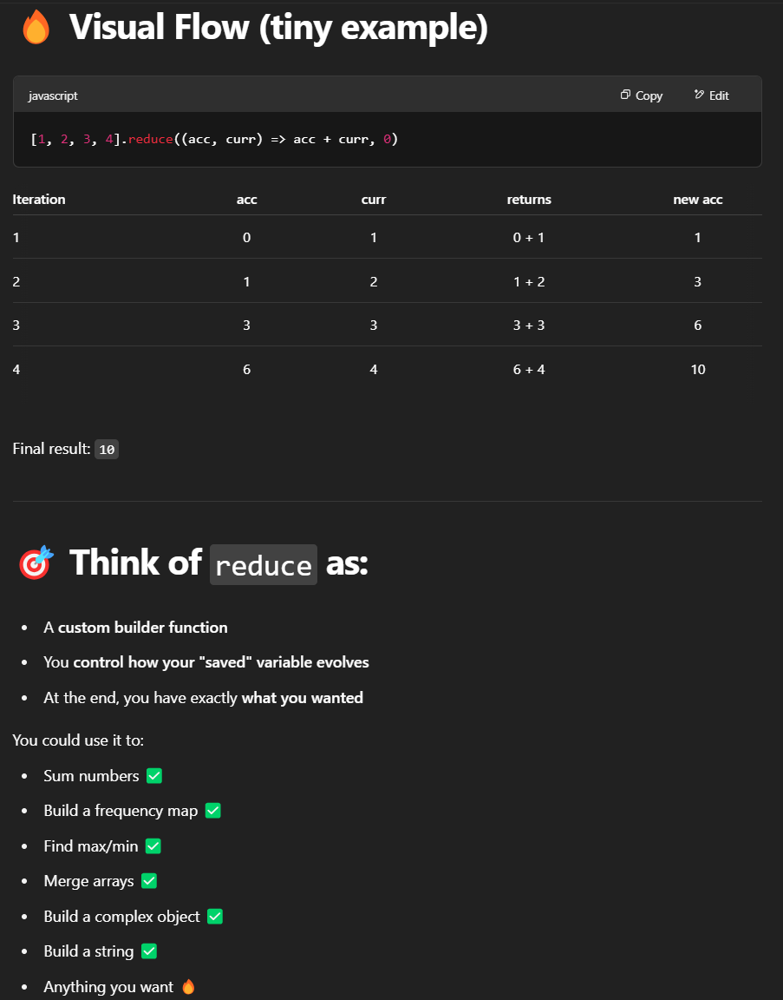
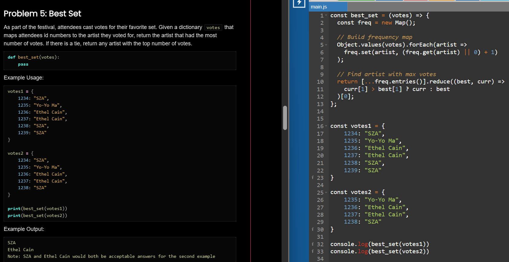

```js
function lineup(artists, set_times) {
    let line_up = new Map()
    for (let i = 0; i < artists.length; i++) {
        line_up.set(artists[i], set_times[i])
    }
    return line_up
}

let artists1 = ["Kendrick Lamar", "Chappell Roan", "Mitski", "Rosalia"]
let set_times1 = ["9:30 PM", "5:00 PM", "2:00 PM", "7:30 PM"]

console.log(lineup(artists1, set_times1))
```


```js
function get_artist_info(artist, festival_schedule) {
    return festival_schedule.has(artist) ? festival_schedule.get(artist) : { message: 'Arist not found'}
}

const festival_schedule = new Map([
  ["Blood Orange", { day: "Friday", time: "9:00 PM", stage: "Main Stage" }],
  ["Metallica", { day: "Saturday", time: "8:00 PM", stage: "Main Stage" }],
  ["Kali Uchis", { day: "Sunday", time: "7:00 PM", stage: "Second Stage" }],
  ["Lawrence", { day: "Friday", time: "6:00 PM", stage: "Main Stage" }]
]);

console.log(get_artist_info("Blood Orange", festival_schedule));

console.log(get_artist_info("Taylor Swift", festival_schedule));
```


```js
function get_artists_info(artists, festival_schedule) {
  return artists.map(artist =>
    festival_schedule.has(artist)
      ? { artist, ...festival_schedule.get(artist) }
      : { artist, message: 'Artist not found' }
  )
}

const festival_schedule = new Map([
  ["Blood Orange", { day: "Friday", time: "9:00 PM", stage: "Main Stage" }],
  ["Metallica", { day: "Saturday", time: "8:00 PM", stage: "Main Stage" }],
  ["Kali Uchis", { day: "Sunday", time: "7:00 PM", stage: "Second Stage" }],
  ["Lawrence", { day: "Friday", time: "6:00 PM", stage: "Main Stage" }]
])

console.log(get_artists_info(["Blood Orange", "Taylor Swift", "Lawrence"], festival_schedule))
```


```js
let total_sales = (ticket_sales) => {
    let res = 0
    for (let value of ticket_sales.values()) {
        res += value
    }
    return res
}

let ticket_sales = new Map([
    ['Friday', 200],
    ['Saturday', 1000],
    ['Sunday', 800],
    ['3-Day Pass', 2500]
])

console.log(total_sales(ticket_sales))
```


```js
const best_set = (votes) => {
    let freq = new Map()
    for (let artist of Object.values(votes)) {
        if (freq.has(artist)) {
            freq.set(artist, freq.get(artist) + 1)
        } else {
            freq.set(artist, 1)
        }
    }
    let max_votes = -Infinity
    let best_artist = ''
    for (let [artist, votes] of freq.entries()) {
        if (votes > max_votes) {
            max_votes = votes
            best_artist = artist
        }
    }
    return best_artist
}

const votes1 = {
    1234: "SZA", 
    1235: "Yo-Yo Ma",
    1236: "Ethel Cain",
    1237: "Ethel Cain",
    1238: "SZA",
    1239: "SZA"
}

const votes2 = {
    1235: "Yo-Yo Ma",
    1236: "Ethel Cain",
    1237: "Ethel Cain",
    1238: "SZA"
}

console.log(best_set(votes1))
console.log(best_set(votes2))
```


```js
const best_set = (votes) => {
  const freq = new Map();

  // Build frequency map
  Object.values(votes).forEach(artist =>
    freq.set(artist, (freq.get(artist) || 0) + 1)
  );

  // Find artist with max votes
  return [...freq.entries()].reduce((best, curr) =>
    curr[1] > best[1] ? curr : best
  )[0];
};


const votes1 = {
    1234: "SZA", 
    1235: "Yo-Yo Ma",
    1236: "Ethel Cain",
    1237: "Ethel Cain",
    1238: "SZA",
    1239: "SZA"
}

const votes2 = {
    1235: "Yo-Yo Ma",
    1236: "Ethel Cain",
    1237: "Ethel Cain",
    1238: "SZA"
}

console.log(best_set(votes1))
console.log(best_set(votes2))
```






```js
const sort_performers = (performer_names, performance_times) => {
  return performer_names
    .map((name, i) => [name, performance_times[i]])
    .sort((a, b) => b[1] - a[1])
    .map(([name, _]) => name);
};


const performer_names1 = ["Mary", "John", "Emma"];
const performance_times1 = [180, 165, 170];

const performer_names2 = ["Alice", "Bob", "Bob"];
const performance_times2 = [155, 185, 150];

console.log(sort_performers(performer_names1, performance_times1)); 
// ["Mary", "Emma", "John"]

console.log(sort_performers(performer_names2, performance_times2)); 
// ["Bob", "Alice", "Bob"]
```


```js
const most_endangered = (species_list) => {
  return species_list.reduce((minSpecies, curr) => 
    curr.population < minSpecies.population ? curr : minSpecies
  ).name;
};

const species_list = [
  { name: "Amur Leopard", habitat: "Temperate forests", population: 84 },
  { name: "Javan Rhino", habitat: "Tropical forests", population: 72 },
  { name: "Vaquita", habitat: "Marine", population: 10 }
];

console.log(most_endangered(species_list));
// Output: "Vaquita"
```