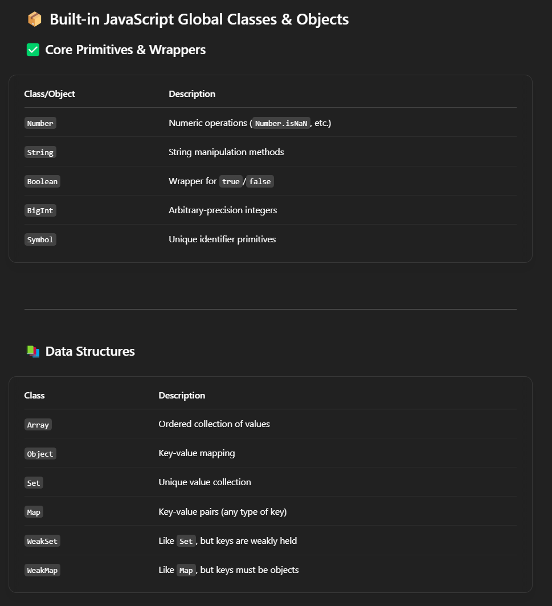
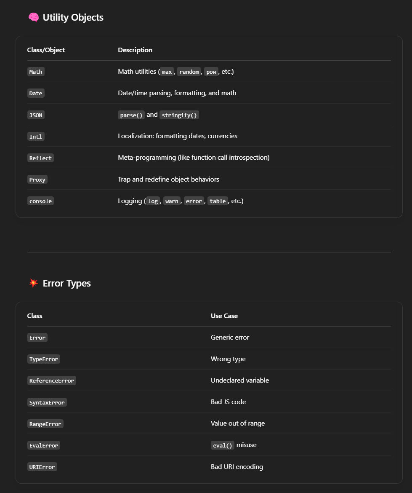
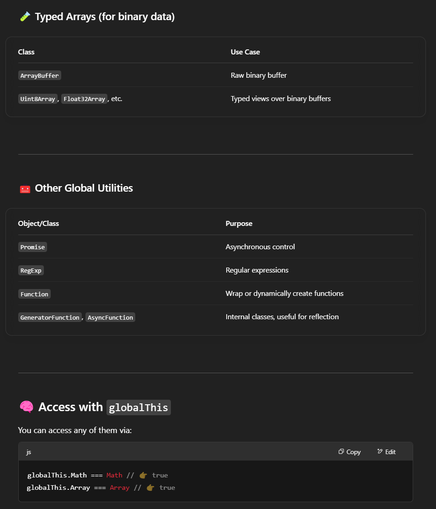
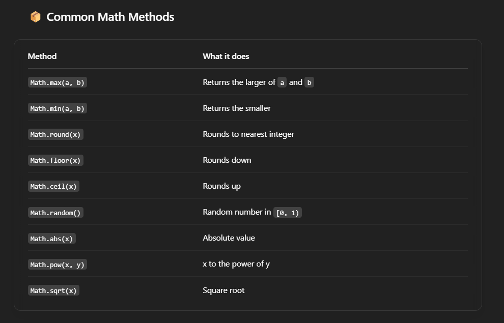

you're a javascript expert and will act as a search engine for any javascript queries, for example if a user asks about javascript array functions or the length, you will generate quality example code showing those features


```js
function multiply(one, two) {
    return one * two
}

function add(one, two) {
    return one + two
}

function math(one, two, operation) {
    return operation(one, two)
}

console.log(math(4, 2, add))
```


```js
const myNumbers = [4, 1, -20, -7, 5, 9, -6]

function remove(numbers, callback) {
  const myArray = []
  for (const x of numbers) {
    if (callback(x)) {
      myArray.push(x)
    }
  }
  return myArray
}

console.log(remove(myNumbers, (x) => x >= 5))
```


```js
function blackjack(num) {
    if (num === 21) {
        console.log('Blackjack!')
    } else if (num > 21) {
        console.log('Bust')
    } else if (17 < num && num < 21) {
        console.log('Good Hand')
    } else {
        console.log('Hit me')
    }
}


blackjack(12)
blackjack(18)
blackjack(21)
blackjack(32)
```


```js
let a = [1, 3, 5]
let y = [2, 4, 6]

let x = []

for (let i = 0; i < Math.max(a.length, y.length); i++) {
    x.push(a[i])
    x.push(y[i])
}

console.log(x)
```







```js
let a = [1, 3, 5]
let y = [2, 4, 6]

let x = []

for (let i = 0; i < Math.max(a.length, y.length); i++) {
    x.push(a[i])
    x.push(y[i])
}

console.log(x)


const obj = { name: "Pablo", age: 22 }
const jsonStr = JSON.stringify(obj)
console.log(jsonStr) // 👉 '{"name":"Pablo","age":22}'

const parsed = JSON.parse(jsonStr)
console.log(parsed)
console.log(parsed.name)
```


```js
const squares = (nums) => {
    return nums.map((x) => x * x)
}

console.log(squares([1, 2, 3, 4]))

bro = [7, 8, 9]
bro.unshift(6)
console.log(bro)
bro.shift()
console.log(bro)


const bruh = Infinity
console.log(Math.max(bruh, 2))
```


```js
function max_diff(nums) {
    let max = -Infinity, min = Infinity
    
    for (let num of nums) {
        if (num > max) {
            max = num
        }
        if (num < min) {
            min = num
        }
    }
    return max - min
}

console.log(max_diff([1, 2, 3, 4, 5, 6, 7, -7]))
```


```js
function createDict(keys, values) {
  return Object.fromEntries(
    keys.map((key, i) => [key, values[i]])
  )
}

// function createDict(keys, values) {
//   obj = {}
//   for (let i = 0; i < keys.length; i++) {
//       obj[keys[i]] = values[i]
//   }
//   return obj
// }

let keys = ["peanut", "dragon", "star", "pop", "space"]
let values = ["butter", "fly", "fish", "corn", "ship", "shit"]

console.log(createDict(keys, values))


console.log()
```


```js
function print_pair(obj, target) {
    console.log(`Key: ${target}`)
    console.log(`Value: ${obj[target]}`)
}

print_pair({
    spongebob: "squarepants",
    patrick: "star",
    squidward: "tentacles"
}, "patrick")

```

```js
function print_sums(obj) {
    let key_sum = 0, value_sum = 0
    for (let [key, value] of Object.entries(obj)) {
        key_sum += Number(key)
        value_sum += Number(value)
    }
    return [key_sum, value_sum]
}

one = {
    1:2,
    3:4,
    5:6
}

let [bruh, yo] = print_sums(one)

console.log(bruh)
console.log(yo)

console.log(print_sums(one))
```


```js
function restockInventory(currentInventory, restockList) {
    for (const [item, quantity] of Object.entries(restockList)) {
        if (item in currentInventory) {
            currentInventory[item] += quantity;
        } else {
            currentInventory[item] = quantity;
        }
    }
    return currentInventory;
}

// Example usage:
let current_inventory = {
    apples: 30,
    bananas: 15,
    oranges: 10
};

let restock_list = {
    oranges: 20,
    apples: 10,
    pears: 5
};

let updated_inventory = restockInventory(current_inventory, restock_list);
console.log(updated_inventory);

```


```js
function wealthiest_customer(accounts) {
    let max_index = -Infinity, max_balance = -Infinity
    let total_balance = 0
    
    for (let [i, account] of accounts.entries()) {
        for (let balance of account) {
            total_balance += balance
        }
        if (total_balance > max_balance) {
            max_balance = total_balance
            max_index = i
        }
        total_balance = 0
    }
    return [max_index, max_balance]
}

let accounts = [
    [1, 2, 3],
    [3, 2, 1]
]

let accounts2 = [
    [1, 5],
    [7, 3],
    [3, 5]
]

let accounts3 = [
    [2, 8, 7],
    [7, 1, 3],
    [1, 9, 5]
]

console.log(wealthiest_customer(accounts))
console.log(wealthiest_customer(accounts2))
console.log(wealthiest_customer(accounts3))

```
  
```js
function diagonal_sum(grid) {
    let indices = new Set()
    let left = 0, right = grid[0].length - 1
    let sum = 0
    
    for (let i = 0; i < grid.length; i++) {
        let l = JSON.stringify([i, left]), cur_left = grid[i][left]
        let r = JSON.stringify([i, right]), cur_right = grid[i][right]
        
        if (!indices.has(l)) {
            indices.add(l)
            sum += cur_left
        }

        if (!indices.has(r)) {
            indices.add(r)
            sum += cur_right
        }

        left += 1
        right -= 1
    }
    
    return sum
}

let grid = [
    [1, 2, 3],
    [4, 5, 6],
    [7, 8, 9]
]

let grid2 = [
    [1, 1, 1, 1],
    [1, 1, 1, 1],
    [1, 1, 1, 1],
    [1, 1, 1, 1]
]

let grid3 = [
    [5]
]

console.log(diagonal_sum(grid))
console.log(diagonal_sum(grid2))
console.log(diagonal_sum(grid3))

```


```js
function diagonal_sum(grid) {
    let left = 0, right = grid[0].length - 1;
    let sum = 0;
    
    for (let i = 0; i < grid.length; i++) {
        if (left === right) {
            // Same cell, only add once
            sum += grid[i][left];
        } else {
            // Different cells, add both
            sum += grid[i][left] + grid[i][right];
        }
        left++;
        right--;
    }
    
    return sum;
}
```

```js
function diagonal_sum(grid) {
    let sum = 0;
    
    for (let i = 0; i < grid.length; i++) {
        sum += grid[i][i]; // top-left to bottom-right
        if (i !== grid.length - 1 - i) {
            sum += grid[i][grid.length - 1 - i]; // top-right to bottom-left
        }
    }
    
    return sum;
}
```


```js
function defuse(code, k) {
    const n = code.length;
    const result = Array(n).fill(0);

    if (k === 0) return result;

    for (let i = 0; i < n; i++) {
        let sum = 0;

        for (let j = 1; j <= Math.abs(k); j++) {
            let index;

            if (k > 0) {
                index = (i + j) % n;
            } else {
                index = (i - j + n) % n; // +n to handle negative indices
            }

            sum += code[index];
        }

        result[i] = sum;
    }

    return result;
}

console.log(defuse([5, 7, 1, 4], 3));   // [12, 10, 16, 13]
console.log(defuse([1, 2, 3, 4], 0));   // [0, 0, 0, 0]
console.log(defuse([2, 4, 9, 3], -2));  // [12, 5, 6, 13]

```


```js
function reverse_sentence(sentence) {
    return sentence.split(' ').reverse().join(' ')
}


let sentence = "tubby little cubby all stuffed with fluff"
console.log(reverse_sentence(sentence))


let goldilocks_approved = function(nums) {
    let max = -Infinity, min = Infinity
    
    for (let num of nums) {
        if (num > max) max = num
        if (num < min) min = num
    }
    for (let num of nums) {
        if (num != max && num != min) return num
    }
    return -1

}

let nums = [3, 2, 1, 4]
console.log(goldilocks_approved(nums))

let nums2 = [1, 2]
console.log(goldilocks_approved(nums2))

nums3 = [2, 1, 3]
console.log(goldilocks_approved(nums3))

```