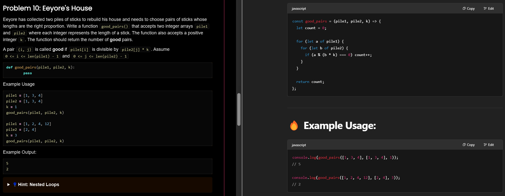

```js
let exclusive_elements = (lst1, lst2) => [
  ...lst1.filter(x => !lst2.includes(x)),
  ...lst2.filter(x => !lst1.includes(x))
]

console.log(exclusive_elements(["pooh", "roo", "piglet"], ["piglet", "eeyore", "owl"]))
// ["pooh", "roo", "eeyore", "owl"]

console.log(exclusive_elements(["pooh", "roo"], ["piglet", "eeyore", "owl", "kanga"]))
// ["pooh", "roo", "piglet", "eeyore", "owl", "kanga"]

console.log(exclusive_elements(["pooh", "roo", "piglet"], ["pooh", "roo", "piglet"]))
// []  
```
  
  
```js
const merge_alternately = (word1, word2) => {
  let merged = ''
  let i = 0, j = 0

  while (i < word1.length || j < word2.length) {
    if (i < word1.length) merged += word1[i++]
    if (j < word2.length) merged += word2[j++]
  }

  return merged
}
```

